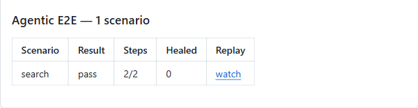
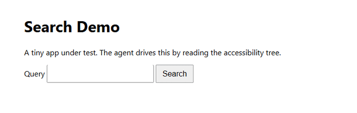

# agentic-e2e

**End-to-end tests you write in plain English, run by an AI agent against a live preview of
your PR — self-healing, with a replay of every failure.**

No selectors. No `page.locator('.btn-primary-2')` that breaks when a designer renames a class.
You describe what a user does; the agent figures out how to do it, and remembers.

<p align="center">
  
</p>

```ts
// agent-e2e.config.ts
import { defineConfig } from "agentic-e2e"

export default defineConfig({
  build: "npm run build",
  serve: "npm run preview",
  port: 4173,
  scenarios: [
    {
      name: "signup-and-checkout",
      steps: `
        Sign up with email %email% and password %password%.
        Add the first item on the home page to the cart.
        Go to the cart and check out with test card %card%.
      `,
      expect: "url:/order-confirmed",
    },
  ],
})
```

Open a PR. A minute later, a comment shows up with a pass/fail table and a replay link for
each scenario — and a green or red check on the PR.

---

## Why bother

End-to-end tests are the ones teams want most and keep least. They rot:

- Around **1 in 7 tests** flake (Google's Engineering Productivity Research), and ~84% of
  pass→fail flips involve a flaky test.
- Fixing a single flaky test takes about **3.7 engineering hours** (Google, 2020).
- **25–50% of QA budgets** go to test maintenance (World Quality Report).
- **10–15% of E2E tests break** after a big frontend deploy — from selector rot alone, with
  zero change in behavior.

The math is brutal. On a 300-test suite where each test independently fails 0.5% of the time,
`1 − 0.995³⁰⁰ ≈ 78%` of runs have at least one flaky failure. That's how the check goes
yellow, then ignored, then deleted.

The root cause is that tests are written against implementation details that change for
reasons unrelated to behavior. So don't write them against implementation details.

## How it works

<p align="center">
  
</p>

1. A Solari **sandbox** builds and serves your PR's code on a temporary preview URL.
2. A stealth **browser** opens it, recording on.
3. The agent reads the page's **accessibility tree** — the same structure a screen reader
   uses — and carries out your English steps by role and name, never by CSS.
4. Every resolved step is **cached to your repo**. The next run replays it with **zero AI
   calls** — it just checks the element still uniquely exists, then acts.
5. When a cached step drifts (someone renamed the button), the agent **re-resolves just that
   step** and the new locator shows up in your diff. Everything else stays cached.
6. A failure only counts as a **regression** if it reproduces on re-runs of the same commit.
   Otherwise it's flagged a flake and doesn't block your merge.

The **healed** count is printed on every run. That number is the whole argument: it's the
change that would have broken a brittle test, quietly absorbed and made visible in review.

## What you need (bring your own keys)

This tool is the **engine**; the API keys are the **fuel** — everyone brings their own.
Installing it shares the code, never anyone's keys. To run it on your repo you sign up for
two accounts and add their keys as **your** repo secrets:

- a **[Solari](https://getsolari.com)** account — the sandbox, the browser, and the recording,
  and
- a **model** account for the agent's brain — [Fireworks](https://fireworks.ai), OpenAI, or any
  OpenAI-compatible endpoint.

Your runs bill **your** accounts, not ours. The keys live only in your repo's encrypted
secrets — never in the published package, never reachable by fork code. (Like a game you
download for free, then log into with your own account.)

## Install

```bash
npm i -D agentic-e2e
npx agentic-e2e init
```

`init` writes your `agent-e2e.config.ts` and two workflows. Then:

1. Add `SOLARI_API_KEY` and `MODEL_API_KEY` as repo secrets.
2. (Recommended) create an **`e2e-privileged`** GitHub Environment with a required reviewer.
3. Open a PR.

## Safe on public repos and forks

The two workflows `init` writes are split on purpose:

- **`e2e-build`** (`pull_request`) runs your fork's code with **no secrets**, builds it, and
  uploads the build as an artifact.
- **`e2e-agent`** (`workflow_run`) runs **base-branch code only**, holds the secrets, and runs
  the agent inside an isolated Solari microVM.

A fork PR can never reach your API key, because the job that holds it never checks out
fork-controlled code. The `e2e-privileged` environment adds a maintainer approval before
secrets are ever exposed to a new contributor.

## What this isn't

Not a replacement for unit or component tests. Not multi-browser. Not visual regression. Not a
hosted service — there's no backend; state lives in your repo and in GitHub.

## Credits

Built for the Pinetree Research build challenge, on [Solari](https://getsolari.com). The
observe/cache/heal loop owes a lot to Stagehand's design.

MIT.
